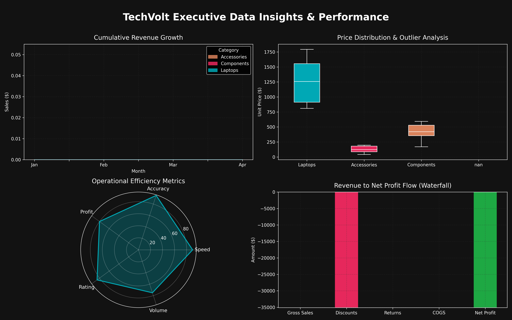

# Executive Data Insights & Performance Dashboard

## Project Overview
An end-to-end data analysis project involving automated data cleaning, aggregation, and performance visualization using Python and Pandas.

## Tech Stack
- **Python** (Pandas, Matplotlib, NumPy)
- **Jupyter Notebook / Google Colab**

## Key Analysis Steps
- Processed transaction records and standardized date fields.
- Implemented automated discount-adjusted net revenue logic.
- Generated multi-panel executive dashboard for strategic monitoring.

## Visual Dashboard

## Repository Contents
- `project1.ipynb`: Analysis notebook.
- `cleaned_sales_100rows.csv`: Processed dataset.
- `dashboard.png`: Executive dashboard render.
